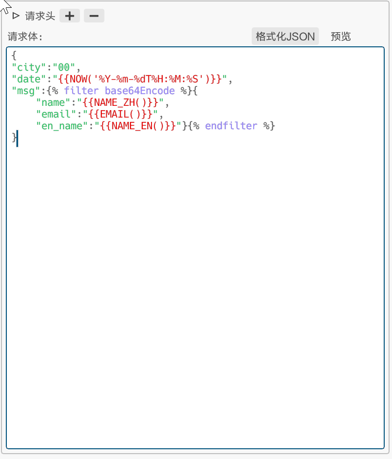

# HttpTester

这是个简单方便的Http测试小工具。自带简单的Fake数据生成、并发测试功能，并支持自定义语法高亮，以及JSON格式化等功能。支持多平台，可执行程序10M多。现在有很多同类型的工具例如PostMan功能强大，有些功能都不是我开发过程中常用的。一部分功能还需要登录才能使用，并且Postman占用内存也高。正好自己在学习rust，就尝试用rust撸了这个小工具。

## 构建

1. [安装rust环境](https://www.rust-lang.org/learn/get-started)

2. 克隆代码
   
   ```git
   git clone https://github.com/HuangJinAmm/http_test_tool.git
   ```

3. 在代码根目录下运行`cargo run`命令运行项目，运行`cargo build --relase`构建项目。

## 使用

1. 界面介绍
   
   - 左边面板里的树状结构为目录，每个节点都代表一个测试案例。
   
   - 筛选条件输入框输入文字，树状目录显示节点标题包含输入文字的节点。
   
   - 选中案例右键的面板中可以输入文字，点击添加则在选中的节点下添加以输入文字为标题的节点，子节点内容与选中的节点内容一样。
   
   - 选中案例时，按`Del`键则会删除选中的节点以及它所有的子节点，**此过程不可逆**。
   
   - 菜单按钮中可以将整个小工具的内容序列化保存为同目录下app.json文件,并可直接加载，或者选则其他位置的json文件，此功能用于共享案例。
   
   

2. 动态请求数据生成
   
   - Fake数据生成采用[Jinja模板语法](https://docs.rs/minijinja/latest/minijinja/syntax/index.html)，以及自带一些数据生成函数`Ctrl+q`调出面板。暂且不支持cookie管理。
   
   
   
   - base64编码内容示例：
   
   
   
   
   
   - AES加密ECB示例
   
   
   
   
   
   - 请求之间的关联变量：`PRE_HTTP`里存储上一个请求的请求(字段`req`表示)和响应数据(`resp`)：
     
     已发送的请求
     
     
     
     这时候可以用关联变量获取上个请求的内容了
     
     
     
     下图是预览结果
     
     
     
     

3. 批量测试
   
   批量测试界面使用的是和单个测试一样的数据测试。上面的是请求响应时间图，下图是响应时间分布图。


## TODO

- [ ] 整理代码
- [ ] 优化ui